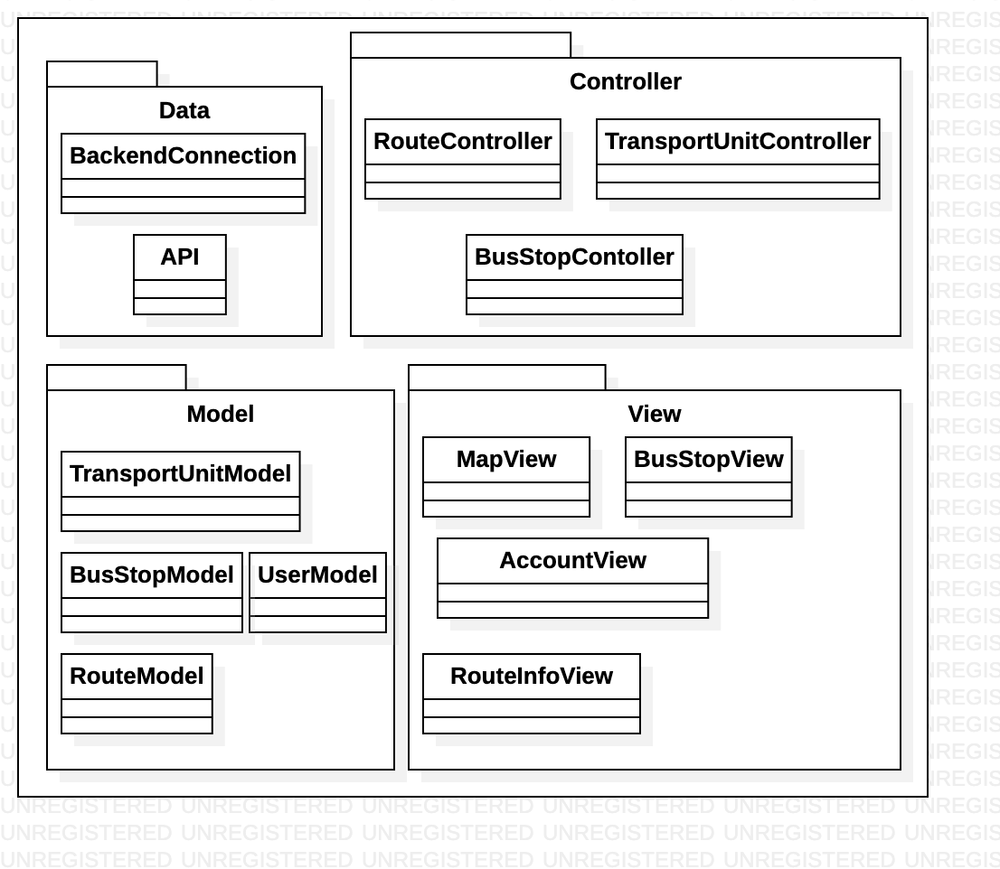

# SIMGRU

SIMGRU es un sistema de rutas y transporte público. Con este sistema el usuario es capaz de visualizar rutas de transporte público, ver las unidades de transporte cercanas a la parada de camión indicada, y por último dar retroalimentación al servicio de transporte.


## Diagramas de la arquitectura


## Requerimientos para ejecutar el código

**Client:** VueJS

**Server:** Node, Express, Sequelize, MySQL

Se pueden tener estos requisitos instalados en su propio ambiente de desarollo, o bien puede utilizar el Docker preparado para ejecutar este programa (Vea siguiente sección)


## Instrucciones para ejecutar el programa

Cuando se quiera ejecutar el programa se puede optar por tener los requerimientos instalados anteriormente, o utilizar un contenedor.

En la raíz de este repositorio se encuentra un archivo Dockerfile como el siguiente:

```dockerfile
FROM arm64v8/ubuntu:latest

RUN apt-get update && \
apt-get upgrade -y && \
apt-get install -y nodejs mysql-server\
apt-get -y install git && \
apt-get install npm \
npm install -g @vue/cli &&

CMD ["bash"]
```

Para crear un contenedor, accede a la ubicación donde se tenga el Dockerfile y ejecuta los siguientes comandos:

```bash
docker build -t nombre-del-contenedor .
docker run -it nombre-del-contenedor bash
```

Ahora que ya se tiene el ambiente de desarrollo creado, se procede a ejecutar el servidor backend y la aplicación web.

Estando en la carpeta /backend/ se ejecuta el siguiente comando para correr el servidor:

```bash
node app.js
```

Para correr la aplicación web se ejecuta el siguiente comando desde la carpeta frontend/simgru/:

```bash
npm run serve
```

Con este proceso se tendrán ambos servidores creados y corriendo.
## Authors

- [Benjamin Bolaños](https://www.github.com/benjabolanos)


## Diagramas de Arquitectura


